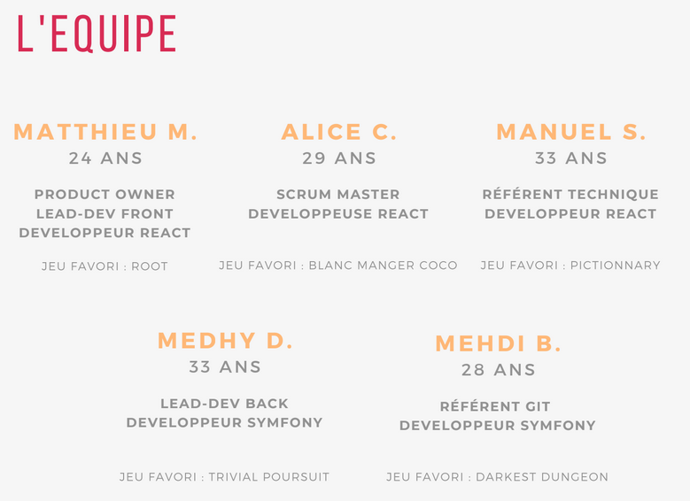

# Dust your Games - Projet


### **[Live Version](https://dustyourgames.com)**

## Bienvenue ! 👋

Voici notre projet dans le cadre d'une formation en développement web & web mobile SYMFONY/REACT.

### 🎲 Présentation du projet
À quoi allons-nous jouer ce soir ? Qu’avons-nous sur nos étagères ? Depuis combien de temps ce jeu prend la poussière ? Autant de questions qui ne facilitent pas la vie des joueurs de jeux de société.

C’est pourquoi aujourd’hui, nous vous proposons Dust Your Games : l’application qui va révolutionner notre façon d'organiser et d’utiliser nos jeux.
Dust your Games est une ludothèque personnelle, un moyen de répertorier virtuellement nos jeux, mais pas seulement :
Depuis notre application, nous souhaitons pouvoir trouver rapidement un jeu adapté pour toutes situations : que vous ayez 5 minutes ou 3 heures, que vous soyez jeune ou moins jeune, que vous soyez un, deux, trois, douze… !

Avec Dust Your Games, dépoussiérons nos jeux en un seul clic. Fini les jeux laissés derrière, vous saurez quand vous aurez joué à votre jeu favori et lesquels commencent à prendre la poussière. Fini aussi les heures passées à décider quel jeu sortir. Grâce à notre fonction Dépoussiérage et à la magie de notre algorithme, vous aurez plus de chance de déterrer des jeux que vous n’aurez pas vu depuis des années et qui correspondent à vos envies du moment.
Connectons nos listes de jeu en ajoutant des amis, nous savons enfin qui possède tel jeu ou telle extension pour être facilement complémentaire, ou bien pour les plus généreux, faire des cadeaux afin de compléter la collection de vos amis !

### L'équipe


### Le cahier des charges

Voici le [cahier des charges](./docs/cdc.pdf) réalisé expliquant notre MVP.

## Déploiement

### Front

Ce projet est livré avec un fichier package.json déjà rempli, toutes les dépendances utilisées y sont donc configurées.

Pour déployer le projet en local :

1. Cloner ce repo sur votre machine
2. Ouvrir un terminal dans le répertoire du projet
3. Faire un `yarn` pour installer toutes les dépendances
4. Pour lancer un serveur de développement faire un `yarn start`
5. Pour consulter le code, ouvrir dans VSCode à partir du terminal avec un `code . `

Une fois le projet déployé en local, on peut le déployer en ligne :

1. Dans un terminal à la racine du projet, exécuter un `yarn build`. Cette commande va réaliser la compilation du code du projet et créer un dossier `build` à la racine contenant une version déployable du projet.
2. Dans le dossier du serveur (souvent `public` ou `public_html`) copier le contenu du dossier `build`.

### Back

Ce projet a besoin du serveur back de lancer pour fonctionner, il est disponible depuis ce [repo](https://github.com/O-clock-apollo/projet-01-dust-your-games-back)
Pour déployer ce serveur, vous aurez besoin :

- D'avoir [Composer](https://getcomposer.org/) d'installer sur le serveur, soit en local, soit en global
- De cloner ce repo dans le dossier du serveur

À partir de là commence l'installation :

1. Depuis un terminal à la racine du serveur, exécuter un `composer install` en global ou un `php composer.phar install`
2. Remplir le .env.local des configurations nécessaires : 

    - Les informations d'une base de données
    - Le nom de domaine dans la section Nelmio Cors
    - Vérifier la présence de JWT

3. Effectuer la migration de la base de données
4. Vérifier les permissions

## Technologies Utilisées

### Front

**Les bases :**

- Yarn :  C’est un gestionnaire de packages qui se double d'un gestionnaire de projets. Utilisé en même temps que npm (node package manager), il nous permet d’installer toutes les dépendances utiles au projet. Celles-ci seront gérées depuis le fichier package.json. 
- HTML/CSS/JS :  Les trois langages d’une page web. Ils seront utilisés à travers tout le projet, parfois par des extensions syntaxiques comme JSX pour l’HTML/le JS ou alors avec une forme alternative comme le SCSS pour le CSS. La mise en production de notre site transpilera l’intégralité de notre code dans ce trio pour qu’il soit lisible par les navigateurs.
- Create React App (CRA) : C’est un package installé depuis npm. Il permet l’initialisation d’un projet React avec une configuration moderne testée, approuvée et maintenue.

**Les dépendances :**

- React : C’est une bibliothèque JavaScript créée par Facebook, elle sera la base de notre projet pour la partie front.
- Redux : C’est une bibliothèque JavaScript open-source pour gérer l'état de l'application. Redux est couramment utilisé avec React pour créer des interfaces utilisateur.
- React-redux : C’est la couche officielle de liaisons de l'interface utilisateur React pour Redux. Il permet à nos composants React de lire les données d'un magasin Redux et d'envoyer des actions au magasin pour actualiser le state.
- React Router Dom : React Router DOM est un package qui va nous permettre d'implémenter un routage dynamique dans une application Web. On utilise le processus de Routing qui permet de changer le contenu dynamiquement en fonction de l'URL depuis une page unique.
- Axios : En quelques mots, Axios est une bibliothèque Javascript utilisée pour effectuer des requêtes HTTP à partir du navigateur qui prend également en charge l'API ES6 promise. Il nous servira surtout pour communiquer avec l’API produite par l’équipe Symfony.
- SASS : Nécessaire pour utiliser le SCSS, c’est un préprocesseur qui, comme Babel, traduira notre code en CSS lisible par les navigateurs.
- cloudinary-react : Permet de délivrer nos images depuis le cdn Cloudinary
- dompurify : Permet de purifier de l'HTML avant l'insertion dans du JSX
- react-autosize-textarea : Donne accès à un composant text-area avec une hauteur automatique.

### Back

**Les bases :**

- Symfony : C’est un framework php, il sera la base de la partie back de notre projet
- Doctrine : Cette ORM permet de faire le lien entre les objets et les éléments d’une base de données.
- MariaDB : Dérivé de MySQL, c’est un système de gestion de base de données édité sous licence GPL.

**Les bundles:**

- Identification & sécurisation API : JWT Token, il offre la possibilité d’utiliser les JSON Web Tokens afin de protéger les ressources de votre API REST. Lorsque l’utilisateur s’authentifie correctement, un token lui sera retourné. Ce token sera ensuite transmis au serveur afin de permettre à l’utilisateur de lire ou d’écrire les ressources protégées.
- Bundle NelmioCorsBundle : Le cors-bundle permet de définir les règles CORS. Ce bundle permet de définir les domaines qui auront accès à votre API REST. Dans notre cas l’api et le front n’étant pas hébergé sur le même serveur nous devons lui ouvrir les “portes”.
- Bundle symfony/filesystem : Le composant Symfony Filesystem fournit des méthodes d'encapsulation utiles qui facilitent l'interaction des fichiers. Pour notre cas il est utile dans notre service PicturesManager qui a pour but d’ajouter ou supprimer une image et par la même occasion lors d’un remplacement d’image, le service s’occupera de supprimer l’ancienne image.
- DoctrineExtensions Beberlei bundle : il ajoute des fonctions supplémentaires pouvant être fournies par la DB. Par exemple, dans notre cas nous l’avons utilisé afin de récupérer la fonction RAND qui nous sert pour générer des produits aléatoires.
- Bundle Faker & Bundle Fixtures : Ces bundles permettent de créer des données fictives et rapidement afin d’avoir un contenu exploitable durant la phase de développement et de test.

## Fonctionnalités développées

### Craco : 

Create React App Configuration Override ( CRACO ) est une surcouche de configuration simple et compréhensible pour create-react-app.
Elle nous permet de modifier des configurations interne à CRA autrement impossible à modifier.
Ici, on créait un alias `@` correspondant au dossier `./src`, il nous permettra de facilement accéder au répertoire src depuis n'importe quel fichier.

### LocalStorage with expiration date : 

Nous nous sommes retrouvés face au besoin de sauvegarder des infos utiles dans le localStorage mais celui-ci a une durée de vie infinie (du moins jusqu'à ce que l'utilisateur le supprime).
Nous avons donc mis en place [deux fonctions](./src/utils/localStorage.js) : `setWithExpiry` et `getWithExpiry`.
La première `setWithExpiry` permet, en indiquant la clé, la valeur à sauvegarder et un temps à garder en storage (1s = 1000), de mettre en localStorage l'item donné.
Il n'est pas nécessaire de jsonifier l'item, cette action est effectuée dans la fonction directement.
La seconde `getWithExpiry` récupère l'item en fonction de la clé et s'occupe de vérifier si la durée de vie de l'item est dépassée. Retourne null et supprime l'item du storage si c'est le cas.

### SCSS Theming : 

Nous avons implémenté la fonctionnalité de theming SASS proposé par [@katiemctigue](https://medium.com/@katiemctigue/how-to-create-a-dark-mode-in-sass-609f131a3995).
Dans le fichier [_color-themes.scss](src/styles/_color-themes.scss), on a posé les différents éléments de notre thème dans la variable `$themes`.
On accède à cette fonctionnalité à tout moment dans un fichier SCSS avec :
```scss
@include color-themes.themed() {
        css-property: color-themes.ask("theme-var");
      }
```